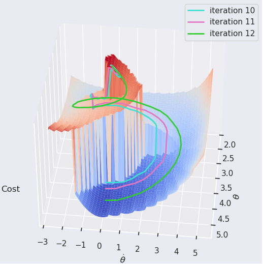
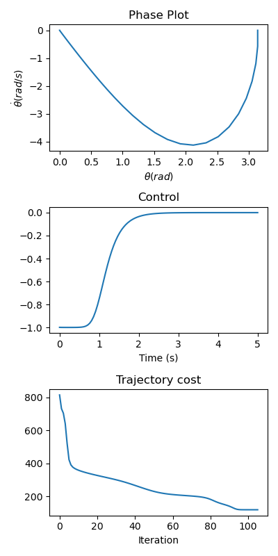

# Differential Dynamic Programming

Differential Dynamic Programming (DDP), first proposed by [David Maybe in 1966](https://www.tandfonline.com/doi/abs/10.1080/00207176608921369) is one of the oldest trajectory optimization techniques in optimal control literature. It is an extension of Dynamic Programming where instead of optimizing over the full state space, we are only optimize around a nominal trajectory by taking 2nd order Taylor approximations. Doing this repeadely allows us to find local solutions of non-linear trajectory optimization problems.

Although simple in principle, it is a surprisingly powerful method which was more recently re-discovered and simplified into [iLQR](https://homes.cs.washington.edu/~todorov/papers/TassaIROS12.pdf) and showcased in [complex humanoid behaviour](https://youtu.be/anIsw2-Lbco).

This repository contains a mostly educational implementation of DDP to go along with my [blog post](http://www.imgeorgiev.com/2023-02-01-ddp/) on it. The implementation is heaviy based on the amazing sympy package which allows for easy computation of symbolic derivatives. It is by no means fast, but very easy to use, read and understand!


### Visualiztion of DDP iterations on a inverted pendulum


## Install

Locally: clone and run

```
pip install -e .
```

Directly from github:

```
pip install pip install git+git://github.com/imgeorgiev/dmc2gymnasium.git
```

## Basic Usage

```python
from ddp import DDPOptimizer

# dynamics
def f(x, u):
    x[0] += x[1]
    x[1] += u[0]
    return x

# instanteneous cost
def g(x, u, x_goal):
    return u**2

# terminal cost
def h(x, u, x_goal):
    error = x-x_goal
    return error.T @ error

N = 10 # trajectory length
x_start = np.array([0.0, 0.0])
x_goal = np.array([0.0, 1.0])

ddp = DDPOptimizer(2, 1, f, g, h)
X, U = ddp.optimize(x_start, x_goal, N=N)
```

## Dynamics and cost functions

The dynamics and cost functions must:
1. be composed using either vanilla Python arithmetic operations or sympy ones. Generally it is a good idea to check if you can differentiate a function you define using `f(x,u).jacobian(x)`
2. return `sympy.Matrix` or `sympy.Vector` types

## Examples

### [Pendulum](ddp/examples/pendulum.py)



### [Cartpole](ddp/examples/cartpole.py)


## Warm starts

The DDP optimization can be  heavily limited by the starting nominal trajectory. If startng with random guesses as in the examples, the optimization process can be slow (>1s). However, if starting from a good guess i.e. warm start, you can converge much faster to your locally optimal trajectory. This is usually the case when DDP is employed in a receeding horizon controller fashion.
